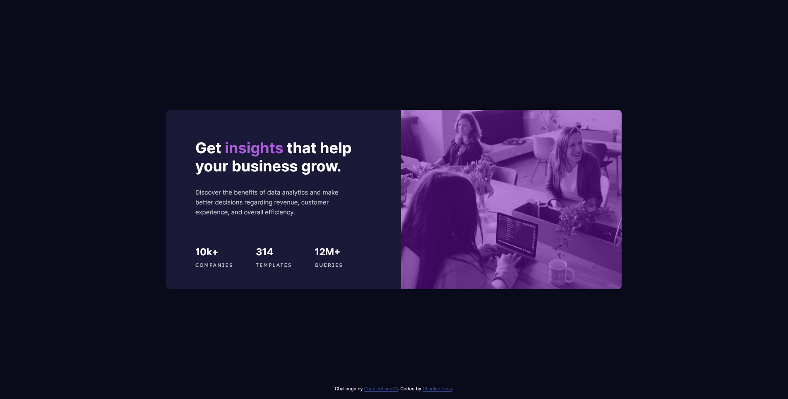

# Frontend Mentor - Stats preview card component solution

This is a solution to the [Stats preview card component challenge on Frontend Mentor](https://www.frontendmentor.io/challenges/stats-preview-card-component-8JqbgoU62). Frontend Mentor challenges help you improve your coding skills by building realistic projects. 

## Table of contents

- [Overview](#overview)
  - [The challenge](#the-challenge)
  - [Screenshot](#screenshot)
  - [Links](#links)
- [My process](#my-process)
  - [Built with](#built-with)
  - [What I learned](#what-i-learned)
  - [Continued development](#continued-development)
  - [Useful resources](#useful-resources)
- [Author](#author)

## Overview

### The challenge

Users should be able to:

- View the optimal layout depending on their device's screen size

### Screenshot

### Links

- Solution URL: (https://charlieeluna23.github.io/stats-preview-card/)
- Live Site URL: (https://your-live-site-url.com)

## My process

### Built with

- Semantic HTML5 markup
- CSS custom properties
- Flexbox
- Mobile-first workflow

### What I learned

I This time I did learn how to add a tint to an image, something I hadn't done before honestly but it helped me had a challenge this time.

### Continued development

I had a hard time styling the stats div because I wasn't able to find a way to correctly do it using only flexbox. Fortunately I later realized a way to do this but I'm not sure if it's a correct solution just adding margin-right.

### Useful resources

- [Example resource 1](https://www.youtube.com/watch?v=E6Iq70_uZwg&ab_channel=HaverikaKrishna) - This helped me find a way to add the purple tint to the background image and just that because in the end the code I used is quite differente as his solution didn't worked for me.

## Author

- FreeCodeCamp - [CharlieeLuna](https://www.freecodecamp.org/CharlieeLuna)
- Frontend Mentor - [@CharlieeLuna23](https://www.frontendmentor.io/profile/CharlieeLuna23)
- Twitter - [@CharlieeLuna](https://twitter.com/CharlieeLuna)
